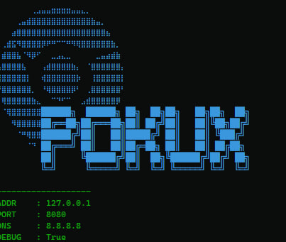

# pokux 🐍

A simple tool to bypass **Deep Packet Inspection (DPI) for Windows**.



# Installation

## Run

1. Download the latest version from the [releases page](https://github.com/13-4dev/POKUXdpi/releases).
2. Unpack the archive.
3. Run `run.bat`.

## Git

To run from the source:

```bash
git clone https://github.com/13-4dev/POKUXdpi.git
cd pokux
python main.py
```


# Usage

```bash
Usage: pokux [options...]
  --addr string            listen address (default "127.0.0.1")
  --debug                  enable debug output
  --dns-addr string        DNS address (default "8.8.8.8")
  --dns-port int           port number for DNS (default 53)
  --enable-doh             enable 'DNS-over-HTTPS'
  --no-banner              disable banner
  --pattern value          bypass DPI only on packets matching this regex pattern; can be given multiple times
  --port int               port (default 8080)
  --system-proxy           enable system-wide proxy (default true)
  --timeout int            timeout in milliseconds; no timeout when not given
  --window-size int        chunk size, in number of bytes, for fragmented client hello
```

> **Note:** If you are using any VPN extensions such as Hotspot Shield in Chrome, go to Settings > Extensions and disable them.

To run pokux , execute `pokux` and then open your favorite browser with the proxy option:

```bash
google-chrome --proxy-server="http://127.0.0.1:8080"
```

you can also use a bat script to launch chrome with these settings automatically

# How it works

`pokux` is an anti-censorship tool designed to bypass Deep Packet Inspection (DPI) by modifying data flows or fragmenting packets to evade detection. It creates a proxy server that intercepts and manipulates network traffic based on user configurations.

### HTTP

`pokux` serves as a proxy for all HTTP connections but does not attempt to bypass DPI for HTTP requests, as most websites now use HTTPS.

### HTTPS

`pokux` bypasses DPI by fragmenting the TLS Client Hello packet into smaller chunks, sending only the first byte initially and the rest after a delay. This technique helps evade DPI detection, which often relies on inspecting the initial part of the packet.

### Key Components

- **Configuration Handling:** Manages all settings through a configuration class (`Config`), including listening address, port, DNS server, proxy settings, and more.
- **Argument Parsing:** Handles user input via command-line arguments to customize `pokux`'s behavior.
- **Logging Setup:** Initializes a logging system to provide debug output if enabled.
- **System Proxy Configuration:** Configures or removes system-wide proxy settings to route traffic through `pokux`.
- **DNS Resolver:** Resolves domain names using standard DNS, system DNS, or DNS-over-HTTPS (DoH) based on user settings.
- **Proxy Server:** Listens for incoming connections, processes HTTP and HTTPS requests, modifies packets if necessary, and forwards them to their intended destinations, effectively bypassing DPI when required.rest after a delay, effectively avoiding DPI detection.

# Inspirations
- [Green Tunnel](https://github.com/SadeghHayeri/GreenTunnel) by @SadeghHayeri
- [GoodbyeDPI](https://github.com/ValdikSS/GoodbyeDPI) by @ValdikSS
- [SpoofDPI](https://github.com/xvzc/SpoofDPI) by @xvzc ★
